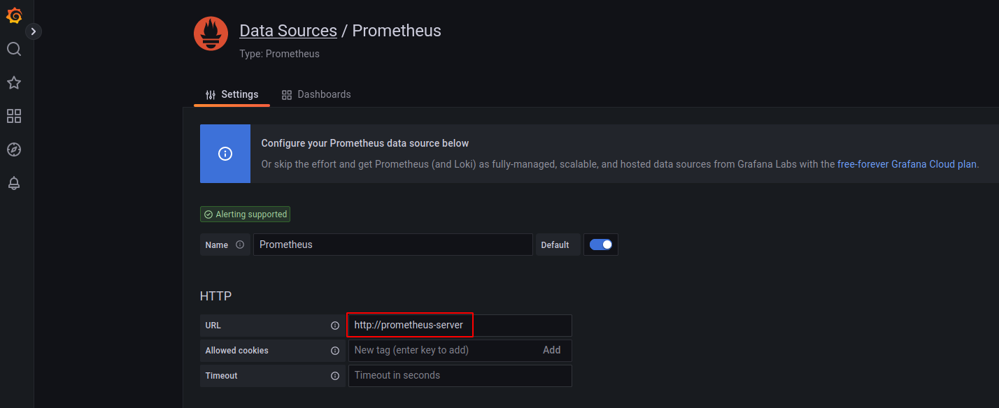

# estrategias_despliegues_k8s

Estudio de los distintos tipos de despliegues que podemos realizar en kubernetes.

## Instalación inicial

Instalamos minikube:

```
minikube start --driver=kvm2 --memory 8192 --cpus 2
```

Instalamos prometheus y grafana:

Añadimos a helm los siguiente repositorios:

```
prometheus-community	https://prometheus-community.github.io/helm-charts
grafana             	https://grafana.github.io/helm-charts  ```

Realizamos la instalación en el namespace `monitoring`:

```
helm install prometheus prometheus-community/prometheus \
    --create-namespace --namespace=monitoring

helm install grafana \
    --namespace=monitoring \
    --set=adminUser=admin \
    --set=adminPassword=admin \
    --set=service.type=NodePort \
    grafana/grafana
```

Comporbamos que se han creado los recursos:

```
kubectl get all -n monitoring
NAME                                                    READY   STATUS    RESTARTS   AGE
pod/grafana-67595f4685-h8sd6                            1/1     Running   0          57s
pod/prometheus-alertmanager-0                           1/1     Running   0          71s
pod/prometheus-kube-state-metrics-7c5864db6b-rpjwm      1/1     Running   0          71s
pod/prometheus-prometheus-node-exporter-4t224           1/1     Running   0          71s
pod/prometheus-prometheus-pushgateway-684dc6674-777sd   1/1     Running   0          71s
pod/prometheus-server-6cddb96778-9whfs                  1/2     Running   0          71s

NAME                                          TYPE        CLUSTER-IP       EXTERNAL-IP   PORT(S)        AGE
service/grafana                               NodePort    10.106.228.231   <none>        80:31565/TCP   59s
service/prometheus-alertmanager               ClusterIP   10.107.167.61    <none>        9093/TCP       71s
service/prometheus-alertmanager-headless      ClusterIP   None             <none>        9093/TCP       71s
service/prometheus-kube-state-metrics         ClusterIP   10.98.24.241     <none>        8080/TCP       71s
service/prometheus-prometheus-node-exporter   ClusterIP   10.99.242.118    <none>        9100/TCP       71s
service/prometheus-prometheus-pushgateway     ClusterIP   10.111.21.45     <none>        9091/TCP       71s
service/prometheus-server                     ClusterIP   10.103.227.40    <none>        80/TCP         71s

NAME                                                 DESIRED   CURRENT   READY   UP-TO-DATE   AVAILABLE   NODE SELECTOR   AGE
daemonset.apps/prometheus-prometheus-node-exporter   1         1         1       1            1           <none>          71s

NAME                                                READY   UP-TO-DATE   AVAILABLE   AGE
deployment.apps/grafana                             1/1     1            1           57s
deployment.apps/prometheus-kube-state-metrics       1/1     1            1           71s
deployment.apps/prometheus-prometheus-pushgateway   1/1     1            1           71s
deployment.apps/prometheus-server                   0/1     1            0           71s

NAME                                                          DESIRED   CURRENT   READY   AGE
replicaset.apps/grafana-67595f4685                            1         1         1       57s
replicaset.apps/prometheus-kube-state-metrics-7c5864db6b      1         1         1       71s
replicaset.apps/prometheus-prometheus-pushgateway-684dc6674   1         1         1       71s
replicaset.apps/prometheus-server-6cddb96778                  1         1         0       71s

NAME                                       READY   AGE
statefulset.apps/prometheus-alertmanager   1/1     71s

```

Accedemos a grafana:

```
minikube service grafana -n monitoring
```

Y lo configuramos añadiendo como DataSource el servidor de Prometheus `http://prometheus-server`:




